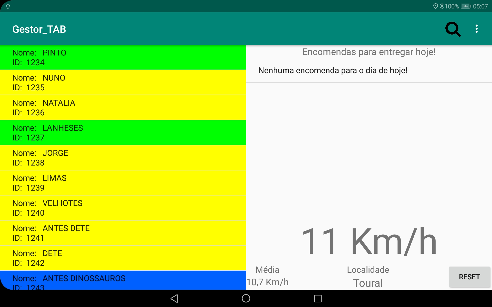
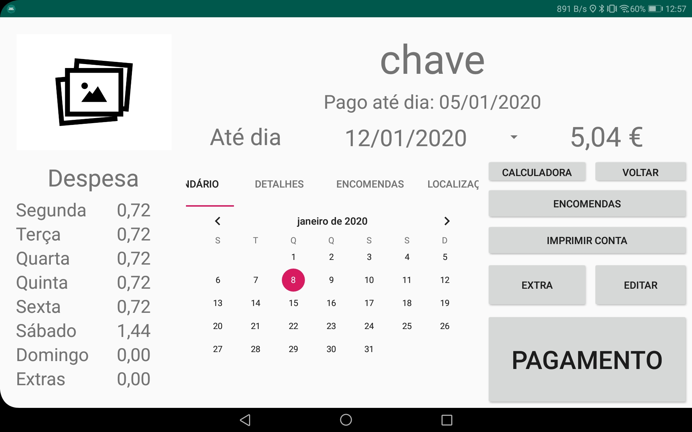

# Gestor_TAB
# 1. **Introdução**
Esta aplicação foi desenvolvida para um cenário de processar dados de uma frota de clientes de uma distribuição ao domicilio de produtos de panificação, pastelaria e derivados.

# 2. **Requisitos**
  - Sistema operativo: Android
  - Ecrã: 10.1 polegadas
    - Todo o layout da aplicação foi desenvolvido especificamente para estas medidas no modo horizontal para poder mostrar toda a informação importante.
  - GPS, Bluethoot, Internet

# 3. **Funções**
  - Main Page (Página principal)
    - Pagina onde são enumerados todos os clientes. São mostrados com diferentes cores:
      - Verde: Pagamento mensal
      - Amarelo: Pagamento semanal
      - Azul: Pagamento Diário
      - Laranja: Pagamento Semanal em que as quantidades diárias podem variar.
      - Vermelho: Cliente que não quer nenhum produto nesse dia.
    - Enumeração de encomendas realizadas pelos clientes que terão de ser entregues no dia.
    - Encomenda do total de produtos para venda no dia seguinte
    - Pequenas funções de processamento de dados gps:
      - Velocimetro
      - Especificamento da localidade da localização atual
      - Localização do cliente mais próximo e abertura da respetiva página de cliente

 

  - Página do Cliente
    - Mostrar informação relativa ao ultimo pagamento e cálculo da divida.
    - Mostrar informação relativa às despesas por dia da semana.
    - Detalhe de todas as operações realizadas com o mesmo tal como:
      - Edição
      - Pagamento
      - Inatividade
      - Adição/subtração de extras
      - Encomendas realizadas
    - Imprimir a conta com recurso a uma impressora térmica por bluethoot.
    - Abrir uma calculadora
    - Definir a localização do cliente
    

